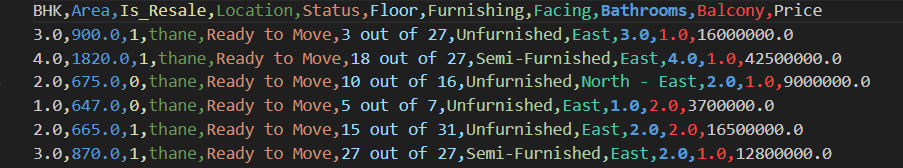

# House Price Predictor

This project uses the python sklearn library and linear regression to predict the price of house and flat across the different cities of India based on the features

## Project Structure
 
 The Project Structure is as follows 

```text 
House Price Predictor/
├── dataset/
│   └── dataset.csv
├── model/
│   └── model.pkl
├── train.py
├── predictor.py
└── README.md
```

## Requirements

- Python 3.14 
- pandas
- scikit-learn
- pickle 

Install dependencies:

```bash
py -m pip install pandas
py -m pip install scikit-learn
py -m pip insatll pickle 
```
## Dataset used in this project is obtained from kaggle
1) Go to kaggle.com and get a dataset ,
   https://www.kaggle.com/datasets/juhibhojani/house-price
2) Download the CSV file of the dataset
3) Clean the dataset for the required part , use the following code 
 ```bash
 import pandas as pd
import re
data = pd.read_csv('dataset/house_prices.zip')
data = data[data['Amount(in rupees)'] != 'Call for Price']
data = data.dropna(subset=['Amount(in rupees)', 'Carpet Area', 'Title'])
def get_bhk(title):
    try:
        match = re.search(r'(\d+)\s*BHK', str(title), re.IGNORECASE)
        if match: return float(match.group(1))
        return 2.0  
    except: return 2.0  
def clean_price(val):
    val = str(val).replace(',', '')
    if 'Lac' in val: return float(val.replace('Lac', '').strip()) * 100000
    if 'Cr' in val: return float(val.replace('Cr', '').strip()) * 10000000
    return float(val)
def clean_area(val):
    try: return float(str(val).split(' ')[0])
    except: return None
def clean_count(val):
    val_str = str(val).replace('>', '').replace('+', '').strip()
    try: return float(val_str)
    except: return None
print("Extracting and rescuing the valuable features...")
data['BHK'] = data['Title'].apply(get_bhk)
data['Price'] = data['Amount(in rupees)'].apply(clean_price)
data['Area'] = data['Carpet Area'].apply(clean_area)
data['Is_Resale'] = data['Transaction'].apply(lambda x: 1 if x == 'Resale' else 0)
data['Bathrooms'] = data['Bathroom'].apply(clean_count)
data['Balcony'] = data['Balcony'].apply(clean_count)
data['Location'] = data['location']
data['Status'] = data['Status']           
data['Floor'] = data['Floor']             
data['Furnishing'] = data['Furnishing']   
data['Facing'] = data['facing']           
smart_columns = [
    'BHK', 'Area', 'Is_Resale', 'Location', 'Status', 
    'Floor', 'Furnishing', 'Facing', 'Bathrooms', 'Balcony', 'Price'
]
clean_df = data[smart_columns].dropna() 
clean_df.to_csv('dataset/clean_dataset.csv', index=False)
print(f"Success! Saved {len(clean_df)} highly detailed properties to clean_dataset.csv.")
 ```
## Dataset Format

The training script expects `dataset/dataset.csv` with at least these columns:

- `Price` (target)
- `BHK`
- `Area`
- `Is_Resale`
- `Bathrooms`
- `Balcony`
- `Location`
- `Status`
- `Floor`
- `Furnishing`
- `Facing`
   
## Sample Dataset image 
  

## Train the Model
Training the model includes the following steps:
1) Ensure the dataset.csv is present in datasets folder in the above mentioned format 
2) Run the train_model.py in the following way

```bash
python train_model.py
```
Current behavior of `train_model.py`:
- reads `dataset/dataset.csv`
- trains a preprocessing + regression pipeline
- saves model to `model/model.pkl`

3) Model is successfully trained and ready to use 

## Using the model 
1) Ensure that the model.pkl is present under model folder 
2) Run the predictor.py to start the program and use it 

```bash
python predictor.py
```
Currently the `predictor.py` asks for:
- Area
- BHK
- Bathrooms
- Balcony
- Location
- Status
- Furnishing
- Facing
- Floor
- Resale flag (`y` or `n`)

Then it prints an estimated property value.

## Troubleshooting

Model file not found:
- Run `python train_model.py` first.

Dataset file not found:
- Make sure `dataset/dataset.csv` exists.

Invalid numeric input while predicting:
- Enter numbers for Area, BHK, Bathrooms, and Balcony.


